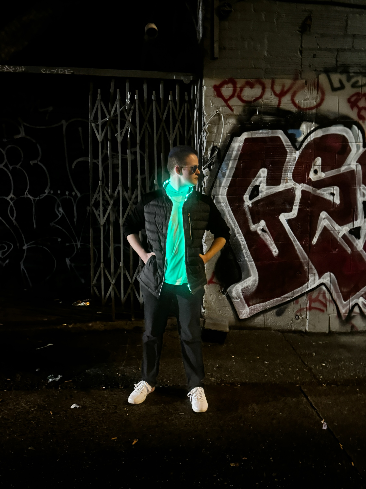
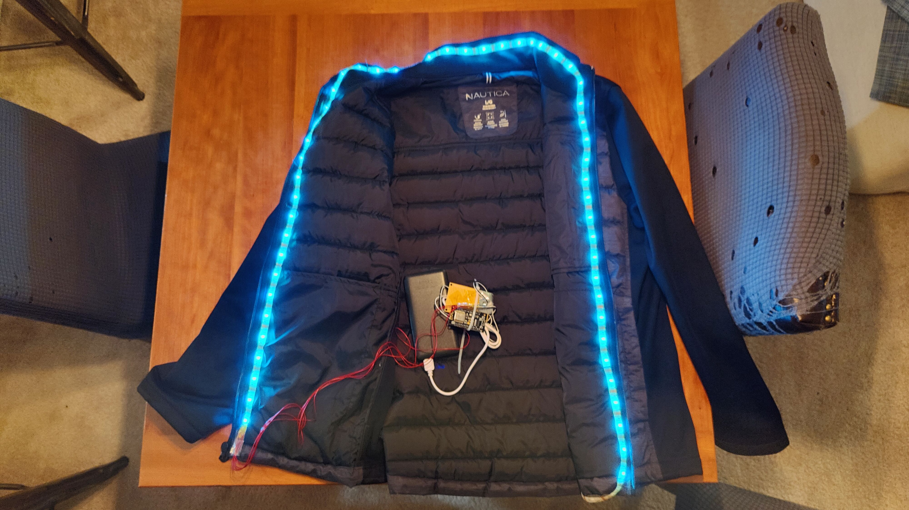
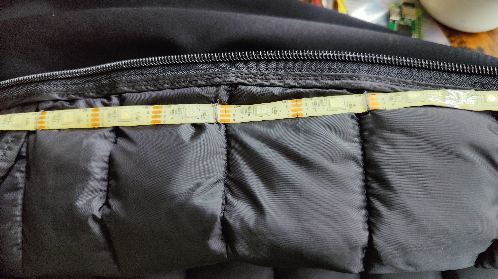
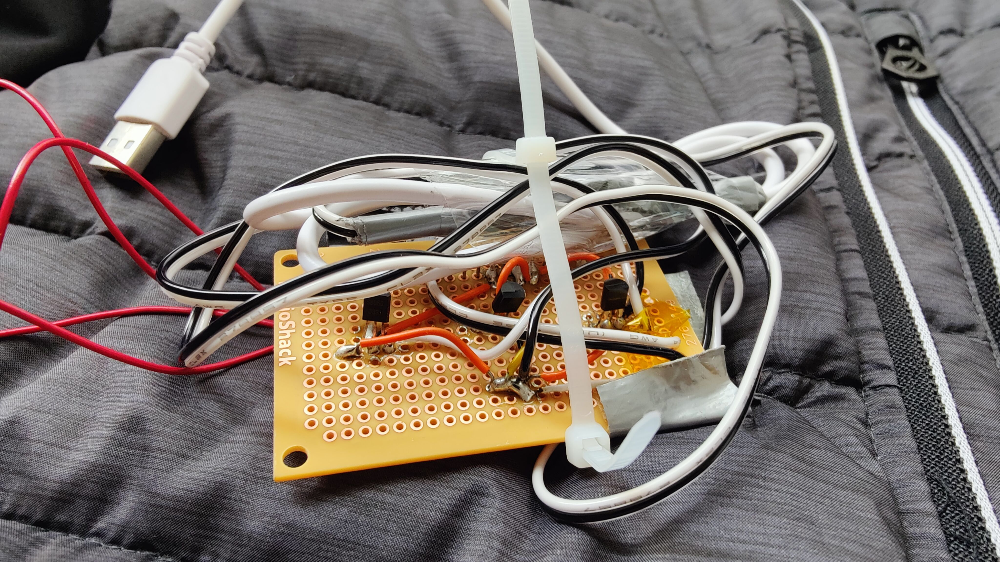
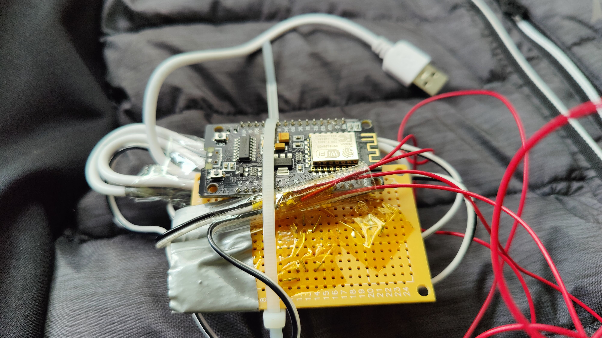
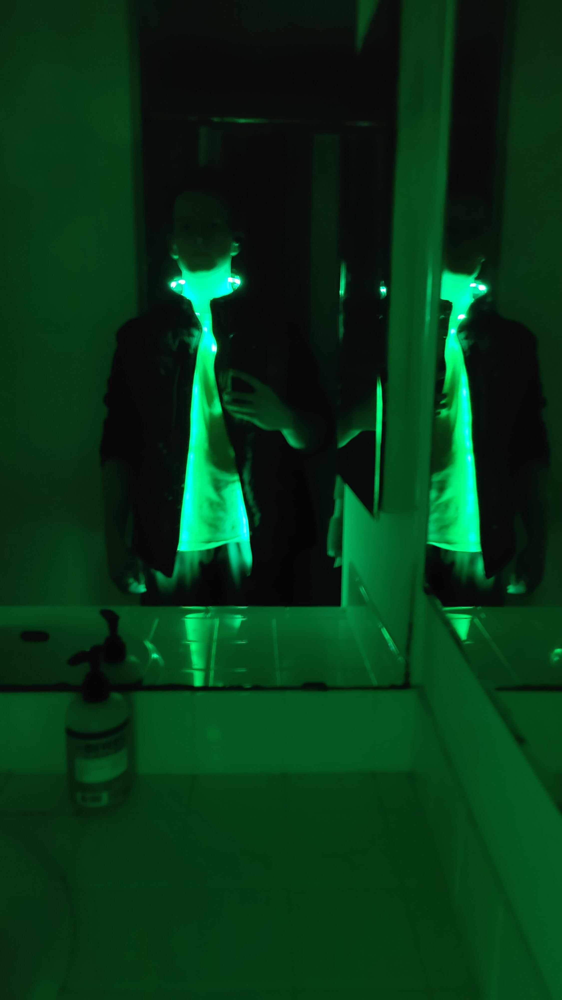
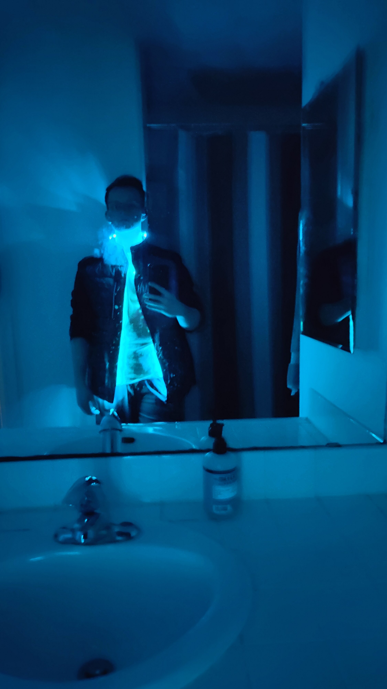
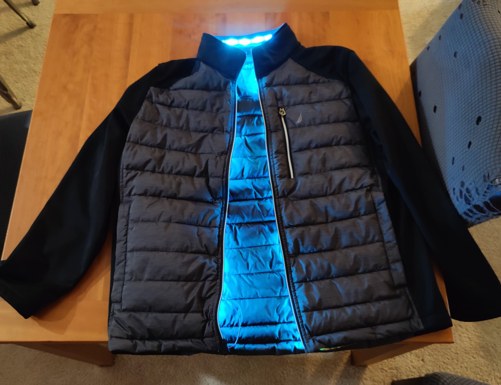

# Spec-tr0 Light Jacket
### Jacket infused with WLED strip control

In this project I set out to make a jacket for a costume with which I could change colors and pulse lights in a pattern,
[WLED](https://github.com/WLED/WLED) allowed for app-based control and minimal fiddling once powered on.

## Jacket Construction

The strip runs hidden along the inside next to the zipper for an ambient lighting effect, and visible around the collar for the exposed design choice.
The battery and circuit board tuck into an existing pocket on the inside.

I decided to sew in the strip for durability rather than use adhesive, and tried to match existing seam lines.

## Circuitry
I used an ESP8266 and a single color RGB LED strip as that's what I had on hand, but opting for a ESP32 increases options available for WLED, and addressable LED strips allow for more impressive patterns to be displayed.
WLED has an option to control single color strips with PWM signals for each RGB channel, and I fed signal each into a transistor to boost the power for that channel.
Power is supplied by a phone battery bank connected by a USB cable spliced to provide 5V to the ESP as well as each transistor. 

*Transistor side of perfboard*

*ESP8266 on perfboard*

## Next steps
I would like to upgrade the microcontroller to an ESP32 and add a microphone, as WLED has better support for audio reactivity on that board.
Ultimately want the jacket to react to sounds, such as pulsing along to the beat of music on a dancefloor, or visually alerting the user to a dangerously loud environment.

## Images

